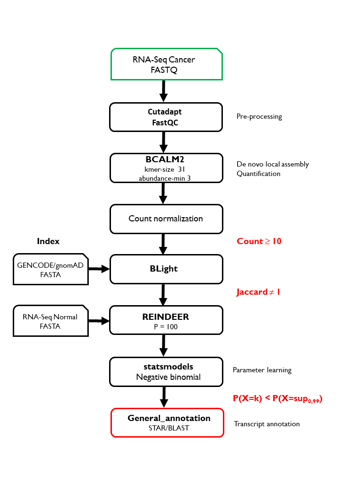

# ksub: k-mer substraction for molecular portraits

M2 project under the supervision of Pr. Daniel Gautheret

* [Motivation](#motivation)
* [Requirements](#requirements)

# Motivation

This project aims to eliminate "normal" transcripts in an RNA-Seq of a tumor using a free-reference approach.
The protocol takes as input an RNA-Seq from a cancer patient, then applies a succession of three filters.
First a quality filter, only the transcripts which have an abundance greater than or equal to 10 are kept. 
The second filter: only the transcripts that are absent from the reference transcriptome annotation (GENCODE) and from the polymorphism libraries (gnomAD) are kept.
Finally the third filter: only the transcripts which deviate significantly from the distribution of the normal RNA-Seq counts are kept.

# Requirements

* [Cutadapt](https://cutadapt.readthedocs.io/en/stable/installation.html)
* [FastQC](https://anaconda.org/bioconda/fastqc)
* [MultiQC](https://multiqc.info/)
* [BCALM2](https://github.com/GATB/bcalm)
* [BLight](https://github.com/Malfoy/Blight)
* [REINDEER](https://github.com/kamimrcht/REINDEER)
* [statsmodels](https://www.statsmodels.org/stable/install.html)
* [General_annotation](https://github.com/aLaine1/general_annotation)